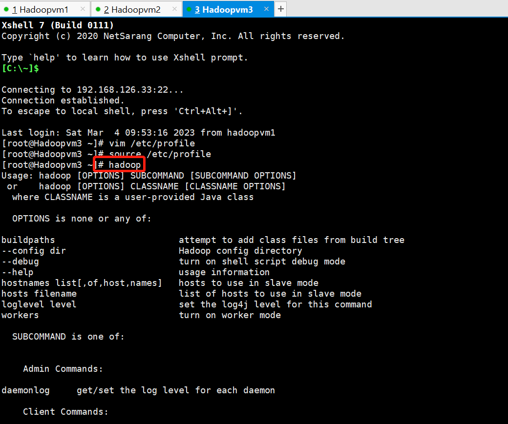

#                                          搭建hadoop集群

### 一、检查java运行环境 jdk1.8

```
java -version
```


### 二、上传hadoop3.1.3安装包

- [ ] 把安装包上传到   /Hadoop/export/software 文件夹


### 三、解压hadoop安装包

- [ ] 进入 /Hadoop/export/software

  ```
  cd   /Hadoop/export/software
  ```


- [ ] 执行把安装包解压到  /Hadoop/export/server/ 文件夹

  ```
  tar zxvf hadoop-3.1.3.tar.gz -C  /Hadoop/export/server/
  ```

  **注意： -c 地址  是代表安装解压到其他文件夹**

****

- [ ] 进入server/  查看加压后的hadoop文件

  ```
  cd  /Hadoop/export/server/ 
  ```

  


所有的配置文件目录：/Hadoop/export/server/hadoop-3.1.3/etc


### 四、配置hadoop核心配置文件

####   （一）、第一类配置文件：  

#####        1、配置hadoop-env.sh     

- [ ] ###### 目的：Hadoop环境变量配置文件

- [ ] 进入/Hadoop/export/server/hadoop-3.1.3/etc/hadoop/文件夹

  ```
  cd /Hadoop/export/server/hadoop-3.1.3/etc/hadoop/
  ```

  

- [ ] 用vim打开：hadoop-env.sh文件

  ```
  vim hadoop-env.sh
  ```

- [ ] 按 i  进入编辑模式   直接添加到 配置文件的最底下：

  ```
  #配置JAVA_HOME   
  export JAVA_HOME=/usr/local/java/jdk1.8.0_251
  #设置用户以执行对应角色shell命令**
  export HDFS_NAMENODE_USER=root
  export HDFS_DATANODE_USER=root
  export HDFS_SECONDARYNAMENODE_USER=root
  export YARN_RESOURCEMANAGER_USER=root
  export YARN_NODEMANAGER_USER=root
  ```


- [ ] 按esc 退出编辑模式     按:wq保存

- [ ] 注意：**不知道java安装目录的退出去** **用which java 查找**

- [ ] ```
  which java
  ```

  
  
  

#### （二）、第二类配置文件

#####        （1）配置core-site.xml   

- [ ] ###### 目的：配置HDFS主角色和配置本地保存数据路径

- [ ] 1 、进入：/Hadoop/export/server/hadoop-3.1.3/etc/hadoop/文件夹

  ```
  cd /Hadoop/export/server/hadoop-3.1.3/etc/hadoop/
  ```

  

- [ ] 使用vim  打开core-site.xml

  ```
  vim core-site.xml
  ```

- [ ] 按 i  进入编辑模式   配置文件：

```
<configuration>
	 <!-- 默认文件系统的名称。通过URI中schema区分不同文件系统。-->
	 <!-- file:///本地文件系统 hdfs:// hadoop分布式文件系统 gfs://。-->
	 <!-- hdfs文件系统访问地址：http://主角色地址:8020。-->
    <!--现在我们把主角色设为HadoopVM1主机  那么这里应该填上主角是的地址Hadoopvm1或者192.168.126.11-->
	<!-- 设置默认使用的文件系统 Hadoop 支持 file 、 HDFS 、 GFS 、 ali|Amazon 云等文件系统 -->
    <property>
            <name>fs.defaultFS</name>
            <value>hdfs://Hadoopvm1:8020</value>
    </property>
    <!-- 设置 Hadoop 本地保存数据路径 -->
    <property>
            <name>hadoop.tmp.dir</name>
            <value>/Hadoop/export/data/hadoop-3.1.3</value>
    </property>
    <!-- 设置 HDFS web UI 用户身份 -->
    <property>
            <name>hadoop.http.staticuser.user</name>
            <value>root</value>
    </property>
          <!-- 整合 hive  用户代理设置 -->
    <property>
            <name>hadoop.proxyuser.root.hosts</name>
            <value>*</value>
    </property>
    <property>
            <name>hadoop.proxyuser.root.groups</name>
            <value>*</value>
    </property>
    <!-- 垃圾桶文件保存时间 -->
    <property>
            <name>fs.trash.interval</name>
            <value>1440</value>
    </property>
</configuration>
```


- [ ] 按esc 退出编辑模式   保存退出

##### （2）配置**hdfs-site.xml**   

- [ ] ###### 目的：配置HDFS文件系统的辅助角色    SecondaryNameNode

- [ ] 1、进入： /Hadoop/export/server/hadoop-3.1.3/etc/hadoop/文件

  ```
  cd  /Hadoop/export/server/hadoop-3.1.3/etc/hadoop/
  ```

  

- [ ] 打开hdfs-site.xml文件  ==》配置HDFS文件系统的辅助角色    SecondaryNameNode

```
vim hdfs-site.xml
```

- [ ] 按i进入编辑模式

  ```
  <configuration>
  <!-- 设置 HDFS文件系统的辅助角色    SecondaryNameNode 进程运行机器位置信息 -->
    <property>
          <name>dfs.namenode.secondary.http-address</name>
          <value>Hadoopvm3:9868</value>
    </property>
  <!-- HDFS 权限控制开启 -->
    <property>
          <name>dfs.namenode.acls.enabled</name>
          <value>true</value>
    </property>
  
  </configuration>
  
  ```

  

- [ ] 按esc退出编辑模式    保存文件


##### （3）配置mapred-site.xml      

- [ ] ###### 目的：配置MapReduce是计算框架

- [ ] 1、进入/Hadoop/export/server/hadoop-3.1.3/etc/hadoop/  文件夹

  ```
  cd  /Hadoop/export/server/hadoop-3.1.3/etc/hadoop/
  ```

  

- [ ] 2、打开mapred-site.xml文件 =》 配置MapReduce是计算框架

  ```
  vim mapred-site.xml
  ```

- [ ] 按i 进入编辑模式

  ```
  <!-- 设置 MapReduce 程序默认运行模式： yarn 集群模式 local 本地模式 -->
      <property>
              <name>mapreduce.framework.name</name>
              <value>yarn</value>
      </property>
      <!-- MapReduce 程序历史服务器端地址 -->
      <property>
              <name>mapreduce.jobhistory.address</name>
              <value>Hadoopvm1:10020</value>
      </property>
      <!-- 历史服务器 web 端地址 -->
      <property>
              <name>mapreduce.jobhistory.webapp.address</name>
              <value>Hadoopvm1:19888</value>
      </property>
      <property>
              <name>yarn.app.mapreduce.am.env</name>
              <value>HADOOP_MAPRED_HOME=/Hadoop/export/server/hadoop-3.1.3</value>
      </property>
      <property>
              <name>mapreduce.map.env</name>
              <value>HADOOP_MAPRED_HOME=/Hadoop/export/server/hadoop-3.1.3</value>
      </property>
      <property>
              <name>mapreduce.reduce.env</name>
              <value>HADOOP_MAPRED_HOME=/Hadoop/export/server/hadoop-3.1.3</value>
      </property>
  
  ```

  

- [ ] 按esc退出编辑模式     保存文件

  

##### （4）配置 yarn-site.xml   

- [ ] ###### 目的：配置yarn集群

- [ ] 1、进入/Hadoop/export/server/hadoop-3.1.3/etc/hadoop/  文件夹

  ```
  cd /Hadoop/export/server/hadoop-3.1.3/etc/hadoop/ 
  ```

  

- [ ] 2、使用vim打开yarn-site.xml 配置yarn组件

  ```
  vim yarn-site.xml
  ```

- [ ] 3、按i 进入编辑模式      

  ```
  <!-- 设置 YARN 集群主角色运行机器位置 -->
      <property>
              <name>yarn.resourcemanager.hostname</name>
              <value>Hadoopvm2</value>
      </property>
      <property>
              <name>yarn.nodemanager.aux-services</name>
              <value>mapreduce_shuffle</value>
      </property>
      <!-- yarn容器允许分配的最小内存 -->
  	<property>
  		<name>yarn.scheduler.minimum-allocation-mb</name>
  		<value>512</value>
      </property>
      <!-- yarn容器允许分配的最大内存 -->
      <property>
          <name>yarn.scheduler.maximum-allocation-mb</name>
          <value>4096</value>
      </property>
  
      <!-- yarn容器允许管理的物理内存大小 -->
      <property>
              <name>yarn.nodemanager.resource.memory-mb</name>
              <value>4096</value>
      </property>
      <!-- yarn对容器实施物理内存限制（这里是true 是开启对物理内存限制） -->
      <property>
              <name>yarn.nodemanager.pmem-check-enabled</name>
              <value>true</value>
      </property>
      <!-- 关闭yarn虚拟内存的限制检查。(这里false不关闭) -->
      <property>
              <name>yarn.nodemanager.vmem-check-enabled</name>
              <value>false</value>
      </property>
      <!-- 开启日志聚集 -->
      <property>
              <name>yarn.log-aggregation-enable</name>
              <value>true</value>
      </property>
      <!-- 设置 yarn 历史服务器地址 -->
      <property>
              <name>yarn.log.server.url</name>
              <value>http://Hadoopvm1:19888/jobhistory/logs</value>
      </property>
       <!-- 环境变量的继承 -->
      <property>
          <name>yarn.nodemanager.env-whitelist</name>
          <value>JAVA_HOME,HADOOP_COMMON_HOME,HADOOP_HDFS_HOME,HADOOP_CONF_DIR,CLASSPATH_PREPEND_DISTCACHE,HADOOP_YARN_HOME,HADOOP_MAPRED_HOME</value>
      </property>
      <property>
            <name>yarn.log-aggregation-enable</name>
            <value>true</value>
      </property>
      <property>
            <name>yarn.log-aggregation.retain-seconds</name>
            <value>604800</value>
      </property>
       <!-- 设置日志聚集服务器地址 -->
    <property>  
      <name>yarn.log.server.url</name>  
      <value>http://hadoopvm1:19888/jobhistory/logs</value>
    </property>
  
  
  ```

  

- [ ] 按esc  退出编辑模式    保存文件


#### （三）、第三类配置文件 

#####    1、配置workers文件   

- [ ] ###### 目的：添加从角色主机地址  用于启动唤醒从角色

- [ ] 1、进入Hadoop/export/server/hadoop-3.1.3/etc/hadoop/文件夹

  ```
  cd /Hadoop/export/server/hadoop-3.1.3/etc/hadoop/
  ```

  

- [ ] 2、使用vim打开  workers文件

  ```
  vim workers
  ```

- [ ] 3、按i 进入编辑模式   添加三个主机地址

  ```
  www.Hadoopvm1.com
  www.Hadoopvm2.com
  www.Hadoopvm3.com
  ```


- [ ] 4、按esc  退出编辑模式   保存文件

  

  ## 上面第一台主机已将配置完了  就把Hadoop安装包同步到另外两台主机

  

### 五、分发同步安装包

#### 1、进入server文件夹

```
cd /Hadoop/export/server
```


#### 2、把配置好的hadoop文件分发同步到另外两台机器

- [ ] 确保已经配置好了  免密登录

```
scp -r hadoop-3.1.3 root@Hadoopvm2:/Hadoop/export/server
scp -r hadoop-3.1.3 root@Hadoopvm3:/Hadoop/export/server
```


```
scp -r hadoop-3.1.3 root@Hadoopvm3:/Hadoop/export/server
```


### 六、配置hadoop环境变量

 1、打开 /etc/profile文件

```
vim /etc/profile
```

2、按i 进入编辑模式：添加

```
#=======================配置Hadoop======================
export HADOOP_HOME=/Hadoop/export/server/hadoop-3.1.3
export PATH=$PATH:$HADOOP_HOME/bin:$HADOOP_HOME/sbin
```


3、按esc 退出编辑模式  保存文件


### 七、同步环境变量

#### 1、把配好的环境变量同步到  hadoopvm2、hadoopvm3

```
scp /etc/profile root@Hadoopvm2:/etc/
scp /etc/profile root@Hadoopvm3:/etc/
```


#### 2、重新加载环境变量 验证是否生效（三台主机）

```
source /etc/profile
```

#### 3、执行：hadoop  查看是否出现hadoop详情

```
hadoop
```




### 八、初始化Hadoop

**首次启动HDFS时，必须对其进行格式化操作。**

**Format****本质就是初始化工作，进行HDFS清除和准备工作**

##### 1、在Hadoopvm1主机执行初始化（其他主机不用操作      本质就像vm1创建群   把vm2和vm3啦进群）

```
hdfs namenode -format
```


######  初始化只要执行成功后，后面千万千万不能在执行了)


### 九、启动Hadoop集群

###### 前提： 配置好机器之间的SSH免密登录和workers文件。

##### 1、  HDFS集群 启动

```
start-dfs.sh
```

##### 2、  HDFS集群 停止

```
stop-dfs.sh
```

###### 使用jps查看服务的启动情况


##### 3、  YARN集群 启动

```
start-yarn.sh
```

##### 4、YARN集群 停止

```
stop-yarn.sh
```


### 十、hadoop集群规划图


HDSF文件系统集群启动(Hadoopvm1执行)

start-dfs.sh

HDSF文件系统集群停止(Hadoopvm1执行)

stop-dfs.sh

Yarn资源管理集群启动（Hadoopvm2）

start-yarn.sh

Yarn资源管理集群停止（Hadoopvm2）

stop-yarn.sh

